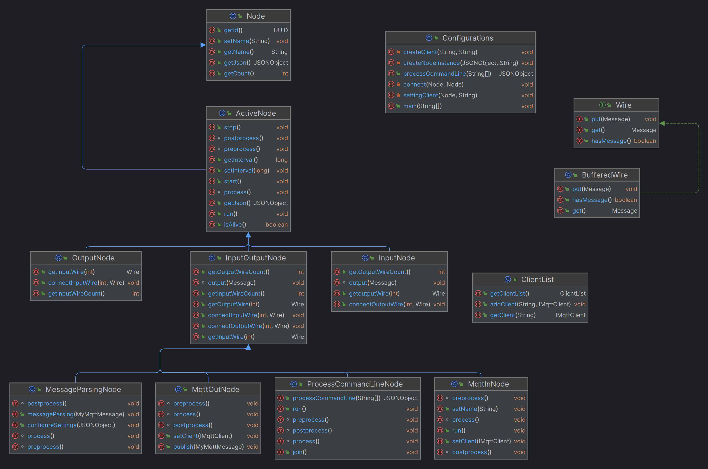

# real_iot_gateway

# MQTT 미니 프로젝트 1팀
 1. 강경훈 (feature/AIGY01-001) 
 2. 김재윤 (feature/AIGY01-004) 
 3. 박종빈 (feature/AIGY01-014)
 4. 전민석 (feature/AIGY01-032) 
 5. 정준호 (feature/AIGY01-035)

## 프로젝트 설명
#### 이 프로젝트는 Node 객체와 메세지를 전달할 wire 객체를 동적으로 생성하며 연결하고, NODE-RED와 같은 역할을 구현하기 위해 만들어진 real_iot_gateway 프로젝트입니다.

## ClientList
- 이 클래스는 MQTT 클라이언트 목록을 관리하고, 싱글톤 패턴을 사용하여 전역적으로 유일한 인스턴스를 제공합니다. 이는 여러 부분에서 동일한 목록에 접근할 필요가 있을 때 유용하며, 클라이언트의 추가 및 조회를 효과적으로 수행하는 역할을 담당합니다.

## Configuration class 

-  Configruation class는 Node, wire 클래스를 관리하며 알맞은 값을 전달하도록 동적으로 노드를 생성하고 wire로 연결하는 등 대부분의 핵심 기능을 담당하는 클래스입니다.

-  JSON 파일에서 구성을 읽어와 해당 구성에 기반하여 다양한 유형의 노드 인스턴스를 동적으로 생성하고, 이러한 노드 간의 연결을 설정하며, 특정 노드에 대한 MQTT 클라이언트를 설정하는 역할을 합니다.

#### 1. createNodeInstance 메서드
 -  주로 노드의 동적 생성 및 설정에 관련된 작업을 수행하고, 각 노드의 특정 유형에 따른 설정을 추가로 처리하는 역할

#### 2. 와이어를 동적으로 생성하여 노드 객체 2개를 이어주는 connect 메서드
- 주로 두 노드를 연결하기 위해 동적으로 와이어를 생성하고, 각 노드의 특정 메서드를 호출하여 와이어를 연결하는 작업을 수행

#### 3. 클라이언트를 생성해주는 createClient 메서드
 - createClient 메서드를 호출하면 MQTT 클라이언트가 생성되고, 이 클라이언트는 ClientList에 추가됩니다. 이후 settingClient 메서드를 사용하여 각각의 Node 객체에 해당 클라이언트를 설정할 수 있습니다.

#### 4. 메인 메소드 인자 값을 적용시켜주는 processCommandLine 메서드
- args에서 전달된 옵션과 함께 설정 파일 등을 고려하여 하나의 JSON 객체로 구성하고 반환

